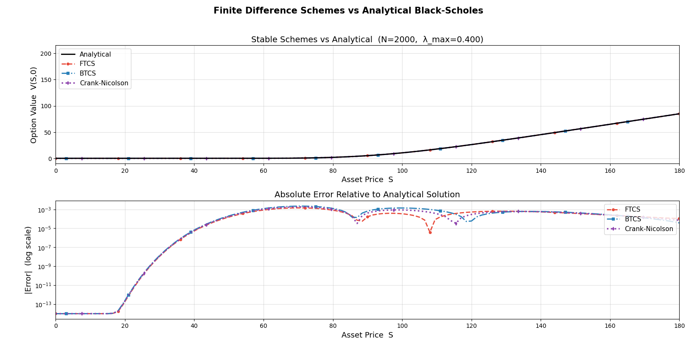
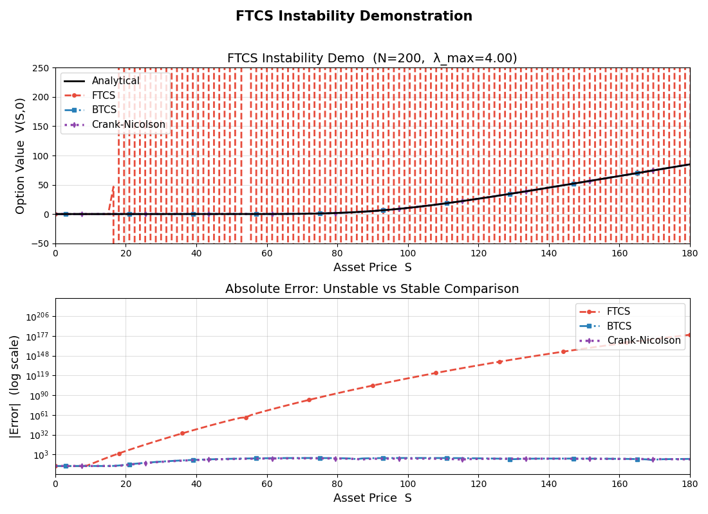

# Black-Scholes PDE: Finite Difference Analysis

Numerical comparison of three finite difference schemes for pricing European call options by solving the Black-Scholes PDE directly in asset-price space. Implemented as part of **Math 449 – Scientific Computing** at the University of Victoria (April 2026).

The full paper is available in [`Black_Scholes_Project_Paper.pdf`](./Black_Scholes_Project_Paper.pdf).

---

## Schemes Compared

| Scheme | Type | Time Accuracy | Stability |
|---|---|---|---|
| FTCS | Explicit | O(Δt) | Conditional (λ ≤ 0.5) |
| BTCS | Implicit | O(Δt) | Unconditional |
| Crank-Nicolson | Implicit | O(Δt²) | Unconditional |

All schemes use centered differences in space — O(ΔS²).

---

## Results

### Stable case (N = 2000, λ_max ≈ 0.40)

All three schemes approximate the analytical solution closely. Crank-Nicolson achieves the lowest error due to its second-order time accuracy.



### Instability demo (N = 200, λ_max ≈ 4.0)

FTCS diverges when the stability condition λ ≤ 0.5 is violated. BTCS and Crank-Nicolson remain stable regardless of step size.



---

## Key Concepts

- **Von Neumann stability analysis** — derives the λ ≤ 0.5 restriction for FTCS
- **Sparse tridiagonal systems** — BTCS and CN solved efficiently via `scipy.sparse`
- **Time-varying boundary conditions** — right boundary tracks the deep in-the-money asymptote S − Ke^(−rτ)
- **Lax Equivalence Theorem** — consistency + stability ⟹ convergence

---

## Setup

```bash
pip install numpy scipy matplotlib
python bs_fd_analysis.py
```

No other dependencies. Tested on Python 3.10+.

---

## Parameters

All parameters are set in `main()` and straightforward to modify:

| Parameter | Default | Description |
|---|---|---|
| K | 100 | Strike price |
| r | 0.05 | Risk-free rate |
| sigma | 0.2 | Volatility |
| T | 1.0 | Time to maturity (years) |
| Smax | 300 | Upper bound of asset price domain |
| M | 200 | Number of spatial intervals |
| N_stable | 2000 | Time steps for stable comparison |
| N_unstable | 200 | Time steps for instability demo |
